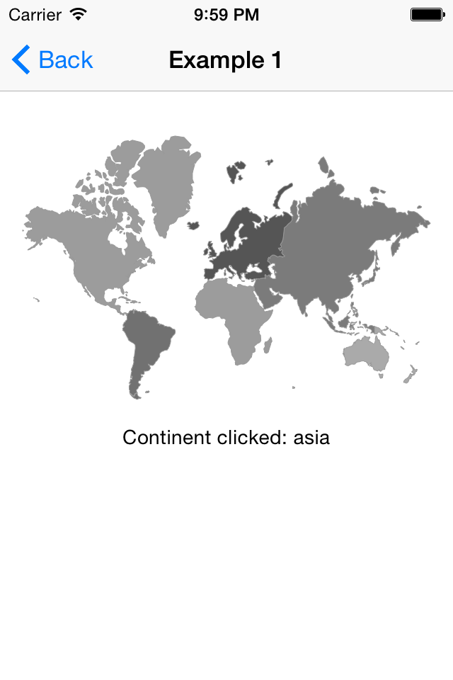
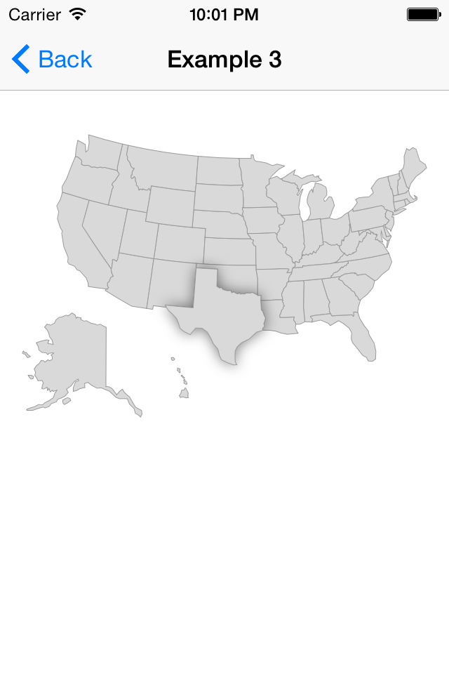

FSInteractiveMap
================

A charting library to visualize data on a map. It's like <a href="https://developers.google.com/chart/interactive/docs/gallery/geochart">geochart</a> but for iOS!

The idea behind this library is to load a SVG file of a map and display it simply in a view. On top of that you can know when a specific area is clicked.

Please note that the SVG loading is quite simple and doesn't support all the features of the SVG file format. It's just good enough to display most of the maps I found in SVG!

Screenshots
---
&nbsp;&nbsp;

How to use
---
FSInteractiveMap is a subclass of UIView so it can be added as regular view. It's basically loading a map from a SVG file. There are a few by default but you can add any SVG you like.

```objc
NSDictionary* data = @{	@"asia" : @12,
                        @"australia" : @2,
                        @"north_america" : @5,
                        @"south_america" : @14,
                        @"africa" : @5,
                        @"europe" : @20
                      };
    
FSInteractiveMapView* map = [[FSInteractiveMapView alloc] initWithFrame:self.view.frame];

[map loadMap:@"world-continents-low" withData:data colorAxis:@[[UIColor lightGrayColor], [UIColor darkGrayColor]]];

[map setClickHandler:^(NSString* identifier, CAShapeLayer* layer) {
    self.detailDescriptionLabel.text = [NSString stringWithFormat:@"Continent clicked: %@", identifier];
}];
```

An example of a "clickable" map:

```objc
FSInteractiveMapView* map = [[FSInteractiveMapView alloc] initWithFrame:CGRectMake(16, 96, self.view.frame.size.width - 32, 500)];
[map loadMap:@"usa-low" withColors:nil];

[map setClickHandler:^(NSString* identifier, CAShapeLayer* layer) {
    if(_oldClickedLayer) {
        _oldClickedLayer.zPosition = 0;
        _oldClickedLayer.shadowOpacity = 0;
    }
    
    _oldClickedLayer = layer;
    
    // We set a simple effect on the layer clicked to highlight it
    layer.zPosition = 10;
    layer.shadowOpacity = 0.5;
    layer.shadowColor = [UIColor blackColor].CGColor;
    layer.shadowRadius = 5;
    layer.shadowOffset = CGSizeMake(0, 0);
}];
```

How to find SVG maps
---
There are a few places where you can find svg files that are suitable for FSInteractiveMap. Here is a short list:
- http://www.amcharts.com/svg-maps/
- http://www.highcharts.com/maps/demo#custom/world-continents
- Wikipedia